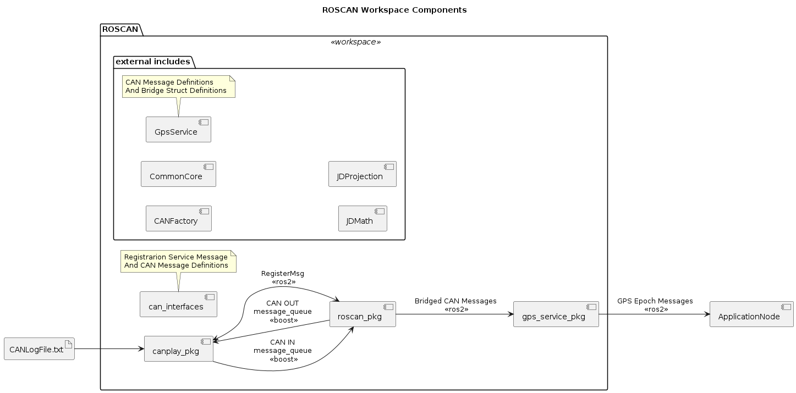
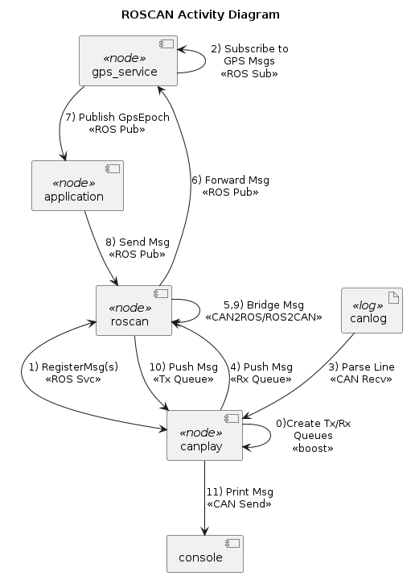
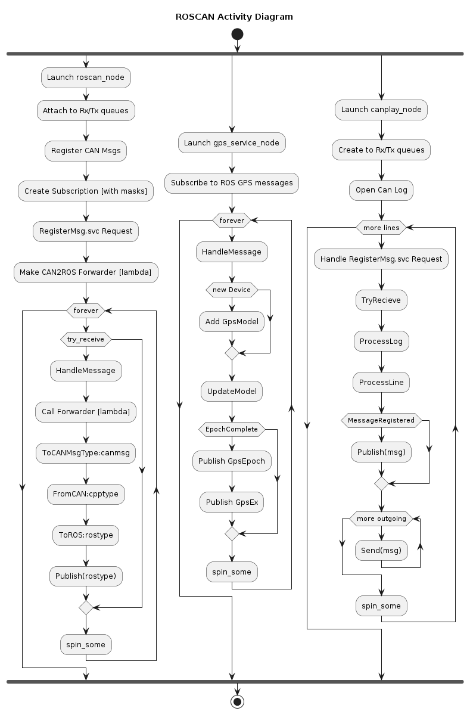
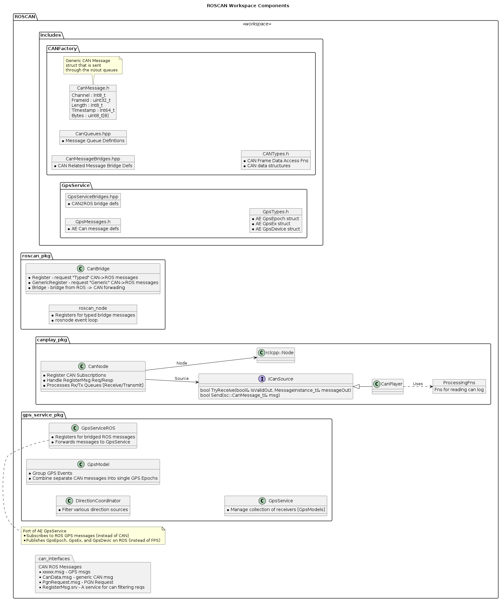

# ROS2 Workspace with CAN Log Playback and Gps Service

This workspace contains:
* A CAN Player Package/Node (canplay_pkg/canplay_node)
* A CAN to ROS2 Bridge Package/Node (roscan_pkg/roscan_node)
* A GPSService example that publishes GPS Epochs (gps_service_pkg/gps_service_node)
* A CAN Interfaces package that defines ROS2-Types for messages

## Features

The following features are included:

* CAN Player can read in and playback CAN log files with approximate timings
* ROSCAN bridge can register for CAN messages and will convert them into ROS2 topics
* GPS Service aggregates a collection of GPS and machine messages into single GPS epoch ROS2 topics

## Architecture

The following sequence shows how messages flow throught this system



1. CAN Player
   1. Read Log File Line
   2. Parse into CAN Message
   3. If CAN message is registered (see RegisterMsg.srv)
      1. Publish CAN message into boost Message Queue
2. ROSCAN
   1. Register a set of CAN messages
      1. Sends RegisterMsg.srv req/resp to CAN Player
   2. Try receive CAN message from boost Message Queue
      1. Find Registered Subscription Masks
      2. Call Registered Parsing Lambda
         1. Cast bytes into CANMessage Can-Type Struct
         2. Convert CAN-Type into CPP-Type (internal C++ struct) for the message
         3. Convert CPP-Type into ROS-Type
         4. Publish ROS-Type on topic
   3. Spins the ROSCAN node
3. GPS Service
   1. Subscribe to Set of GPS Related bridged ROS2 messages
   2. On GPS Message
      1. Convert ROS-Type into CPP-Type
      2. Forwards CPP-Type message to GPS Model class for handling
   3. Once a GPS Model has enough messages to compose a GPS Epoch
      1. Convert GpsEpoch CPP-Type into ROS-Type
      2. Publish GpsEpoch on topic

### Definitions

`CPP-Type` - A C/C++ Struct that describes the native types for a message with Scaled floating point values and enumerated fields

`CAN-Type` - A Bit-Packed C/C++ Struct made of of unsigned integer bit-fields typically packed into an 8-byte message and used to "Cast" a raw CAN message into unsigned data Provides methods to go to & from CPP-Types

`ROS-Type` - A ROS2 Message type that was compiled using ROS2 IDL

`Bridge-Struct` - A Struct type with methods to convert between ROS-Type and CPP-Types along with a topic name

## Adding CAN Messages

Adding boilerplate for extending the ROSCAN bridge with new messages

1. Add a CAN-Type struct to `.../roscan/include/GpsService/GpsMessages.h`
2. Add a CPP-Type struct to `.../roscan/include/GpsService/GpsMessages.h`
3. Add a ROS-Type .msg to `.../roscan/src/can_interfaces/msg`
4. Add a Bridge-Struct to `.../roscan/include/GpsService/GpsServiceBridges.hpp`
5. Register the Bridge-Struct in ROSCAN `.../roscan/src/roscan_pkg/src/roscan_node.cpp`
6. Subscribe to the Bridge-Struct in GPS Service `.../roscan/src/gps_service_pkg/src/GpsServiceROS.cpp`

## Prerequisites

You need Docker and VSCode with the remote containers plugin installed

* [docker](https://docs.docker.com/engine/install/)
* [vscode](https://code.visualstudio.com/)
* [vscode remote containers plugin](https://marketplace.visualstudio.com/items?itemName=ms-vscode-remote.remote-containers)

## Get the template

This workspace is based on a Docker container that I found here:
![Project Template] https://github.com/athackst/vscode_ros2_workspace/tree/humble

## Testing the Nodes

1. Run the roscan_node `canrun.sh`
2. Run the gps_service_node `gpsrun.sh`
3. Run the can player `playerrun.sh`
4. Watch gps epochs with `echo.sh /gps/GpsEpoch`

# Adding CAN Messages to RosCan Bridge
Use the following steps to add new messages to the ROS CAN Bridge
1. Add native (cpptype) and CAN (cantype) structs header file (in AE style)
* See /roscan/include/GpsService/GpsMessages.h
* Code Example:
```
  //Native (cpptype)
  struct VehiclePosition {
    lat64_t Latitude = 0.0;
    lon64_t Longitude = 0.0;
  };
  
  //CAN (cantype)
  struct CANVehiclePosition
  {
     enum { PGN = 0xFEF3 };
     enum { PRIORITY = 6 };
     uint32_t Latitude : 32;
     uint32_t Longitude : 32;    
  
     //cantype->cpptype
     static inline VehiclePosition FromCAN(const sc::CANMsg& msg){
        const auto& in = sc::ToMsg<CANVehiclePosition>(msg);
        VehiclePosition out;
        //Scale float parameters
        out.Latitude = cc::ScaledNoNaN64(in.Latitude, 0.0000001, 210.0);
        out.Longitude = cc::ScaledNoNaN64(in.Longitude, 0.0000001, 210.0);
        return out;
     }    
  
     //cpptype->cantype
     static inline CANVehiclePosition ToCAN(const VehiclePosition& in){
        CANVehiclePosition msg;
        //Un-Scale float parameters
        msg.Latitude = cc::UnscaledNoNaN64<uint32_t>(in.Latitude, 0.0000001, 210.0);
        msg.Longitude = cc::UnscaledNoNaN64<uint32_t>(in.Longitude, 0.0000001, 210.0);
        return msg;
     }    
  };//__attribute__((packed)); If packing is needed
  //Guarantee message is 8-bytes (May need packing)
  ASSERT_EIGHT(CANVehiclePosition);
```

2. Create ROS msg files in can_interface to generate (rostypes)
* Add msg to /roscan/src/can_interfaces/msg/xxxxxx.msg
* Add .msg file to rosidl_generate_interfaces in CMakeLists.txt

3. Add a bridge struct to map between ROS (rostype) and native (cpptype)
* See /roscan/include/GpsService/GpsServiceBridges.hpp

```
#include <GpsService/GpsMessages.h>   //Include native/can message structs
...
#include <can_interfaces/msg/vehicle_position.hpp> //include ROS Generated message

//The bridge namespace
namespace bridge {
//The bridge definition struct
struct VehiclePosition{
  using cantype = gps::CANVehiclePosition; 			//The CAN message struct type
  using cpptype = gps::VehiclePosition;   			//The native CPP struct
  using rostype = can_interfaces::msg::VehiclePosition;  	//The generated ROS type
  static constexpr const char * topic = "/gps/VehiclePosition"; //The topic to publish ROS messages on

  //Convert from cpptype->rostype
  static inline rostype ToROS(const cpptype & in)
  {
    rostype out;
    out.latitude = in.Latitude;
    out.longitude = in.Longitude;
    return out;
  }

  //Convert from rostype->cpptype
  static inline cpptype FromROS(const rostype & in, uint32_t* pFrameId= nullptr, int64_t* pTimestamp= nullptr)
  {
    cpptype out;
    //Parse out can frame and timestamp information
    sc::CanDataFromROS(in, pFrameId, pTimestamp);
    out.Latitude = in.latitude;
    out.Longitude = in.longitude;
    return out;
  }
};
...
```
* Add rosbridge types to the bridges namespace
* Provide definitions for: cantype, cpptype, and rostype
* Provide a ROS topic string
* Define ToROS function
* Define FromROS function

# Diagrams
Various Arcthiecture / Design Diagrams
## Components

## High Level Activity

## Activity

## Design

