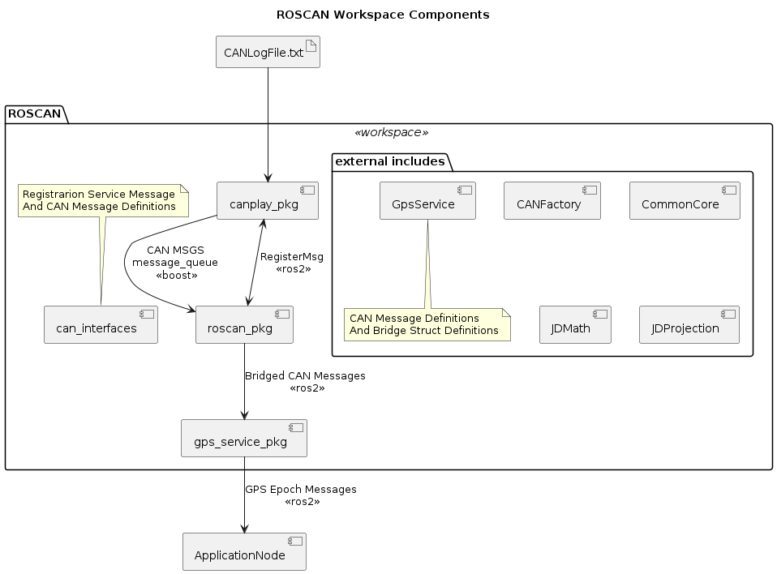

# ROS2 Workspace with CAN Log Playback and Gps Service

This workspace contains:
* A CAN Player Package/Node (canplay_pkg/canplay_node)
* A CAN to ROS2 Bridge Package/Node (roscan_pkg/roscan_node)
* A GPSService example that publishes GPS Epochs (gps_service_pkg/gps_service_node)
* A CAN Interfaces package that defines ROS2-Types for messages

## Features

The following features are included:

* CAN Player can read in and playback CAN log files with approximate timings
* ROSCAN bridge can register for CAN messages and will convert them into ROS2 topics
* GPS Service aggregates a collection of GPS and machine messages into single GPS epoch ROS2 topics

## Architecture

The following sequence shows how messages flow throught this system

1. CAN Player
   1. Read Log File Line
   2. Parse into CAN Message
   3. If CAN message is registered (see RegisterMsg.srv)
      1. Publish CAN message into boost Message Queue
2. ROSCAN
   1. Register a set of CAN messages
      1. Sends RegisterMsg.srv req/resp to CAN Player
   2. Try receive CAN message from boost Message Queue
      1. Find Registered Subscription Masks
      2. Call Registered Parsing Lambda
         1. Cast bytes into CANMessage Can-Type Struct
         2. Convert CAN-Type into CPP-Type (internal C++ struct) for the message
         3. Convert CPP-Type into ROS-Type
         4. Publish ROS-Type on topic
   3. Spins the ROSCAN node
3. GPS Service
   1. Subscribe to Set of GPS Related bridged ROS2 messages
   2. On GPS Message
      1. Convert ROS-Type into CPP-Type
      2. Forwards CPP-Type message to GPS Model class for handling
   3. Once a GPS Model has enough messages to compose a GPS Epoch
      1. Convert GpsEpoch CPP-Type into ROS-Type
      2. Publish GpsEpoch on topic

### Definitions

`CPP-Type` - A C/C++ Struct that describes the native types for a message with Scaled floating point values and enumerated fields

`CAN-Type` - A Bit-Packed C/C++ Struct made of of unsigned integer bit-fields typically packed into an 8-byte message and used to "Cast" a raw CAN message into unsigned data Provides methods to go to & from CPP-Types

`ROS-Type` - A ROS2 Message type that was compiled using ROS2 IDL

`Bridge-Struct` - A Struct type with methods to convert between ROS-Type and CPP-Types along with a topic name

## Adding CAN Messages

Adding boilerplate for extending the ROSCAN bridge with new messages

1. Add a CAN-Type struct to `.../roscan/include/GpsService/GpsMessages.h`
2. Add a CPP-Type struct to `.../roscan/include/GpsService/GpsMessages.h`
3. Add a ROS-Type .msg to `.../roscan/src/can_interfaces/msg`
4. Add a Bridge-Struct to `.../roscan/include/GpsService/GpsServiceMessages.hpp`
5. Register the Bridge-Struct in ROSCAN `.../roscan/src/roscan_pkg/src/roscan_node.cpp`
6. Subscribe to the Bridge-Struct in GPS Service `.../roscan/src/gps_service_pkg/src/GpsServiceROS.cpp`

## Prerequisites

You need Docker and VSCode with the remote containers plugin installed

* [docker](https://docs.docker.com/engine/install/)
* [vscode](https://code.visualstudio.com/)
* [vscode remote containers plugin](https://marketplace.visualstudio.com/items?itemName=ms-vscode-remote.remote-containers)

## Get the template

This workspace is based on a Docker container that I found here:
![Project Template] https://github.com/athackst/vscode_ros2_workspace/tree/humble

## Testing the Nodes

1. Run the roscan_node `canrun.sh`
2. Run the gps_service_node `gpsrun.sh`
3. Run the can player `playerrun.sh`
4. Watch gps epochs with `echo.sh GpsEpoch`
